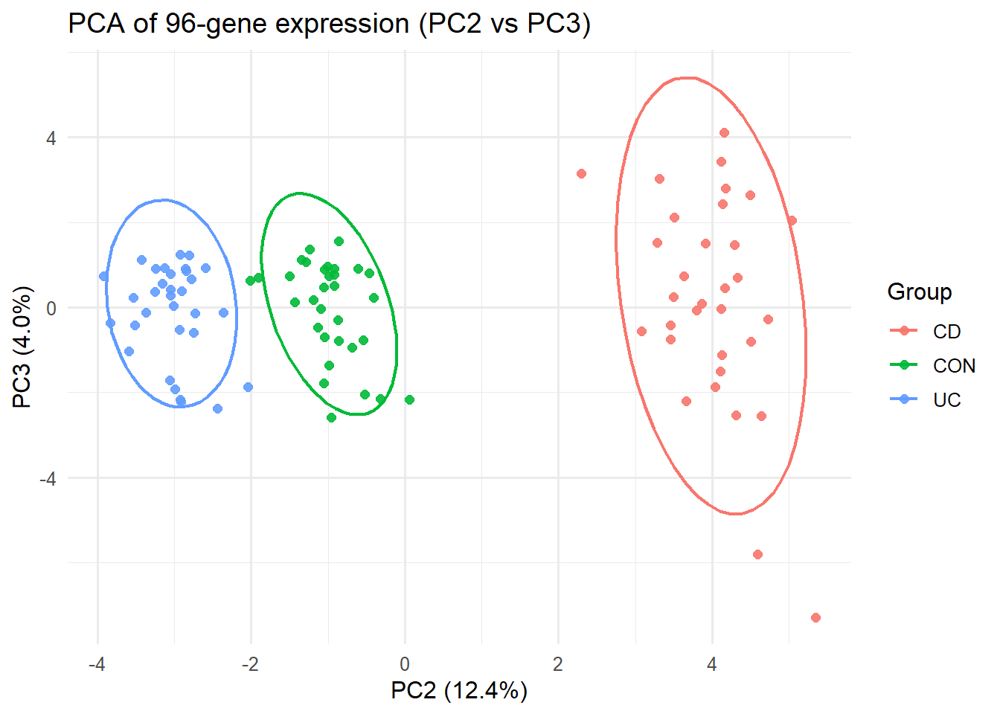
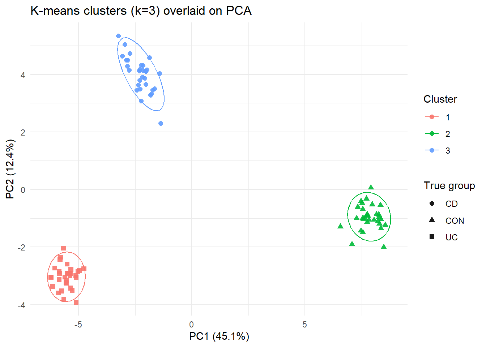
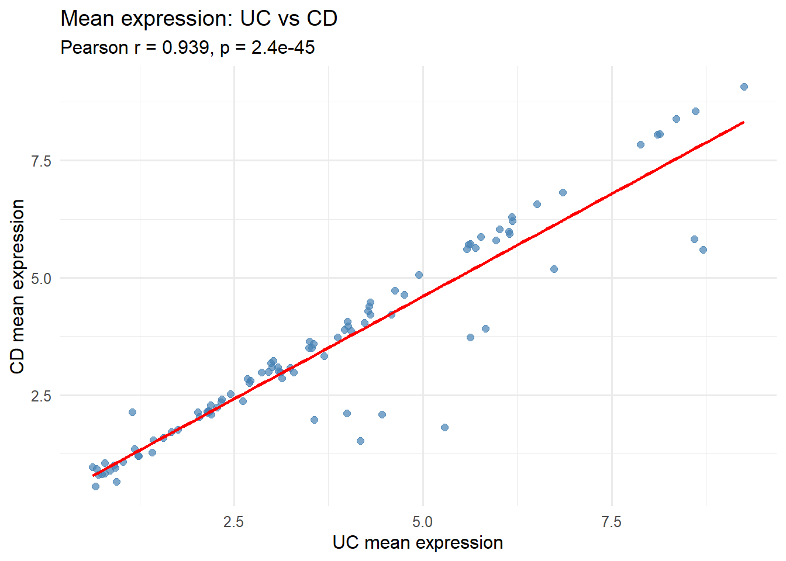
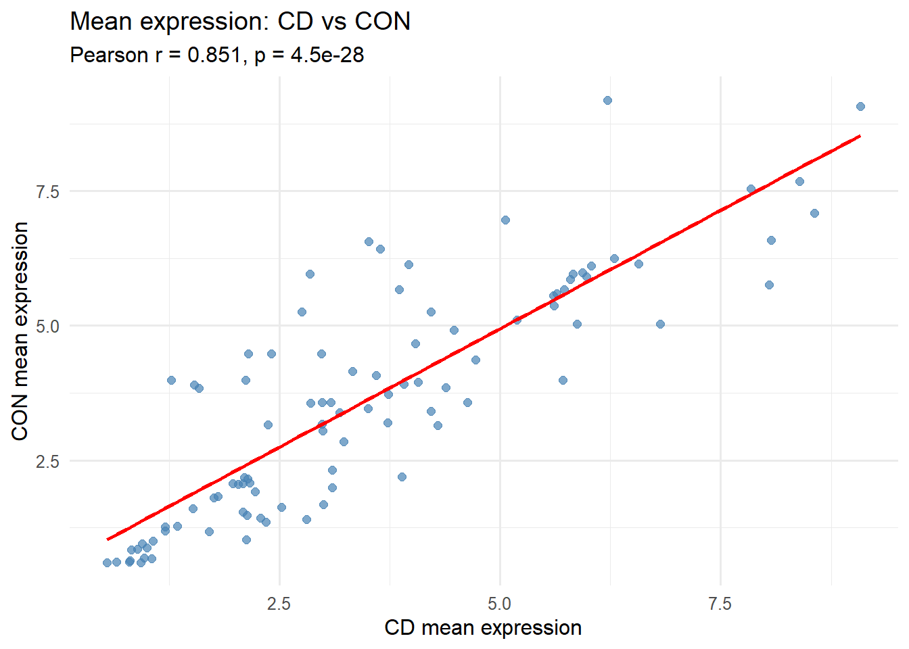
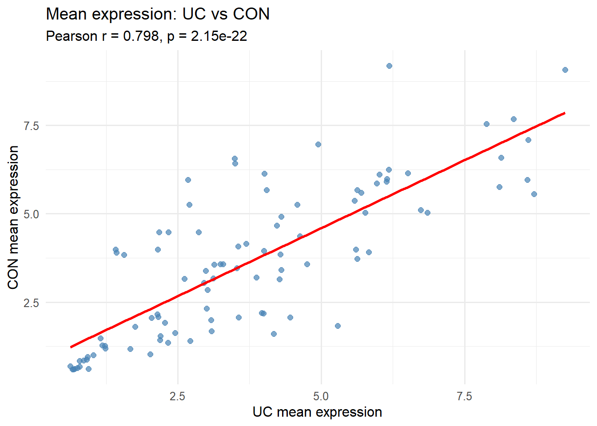
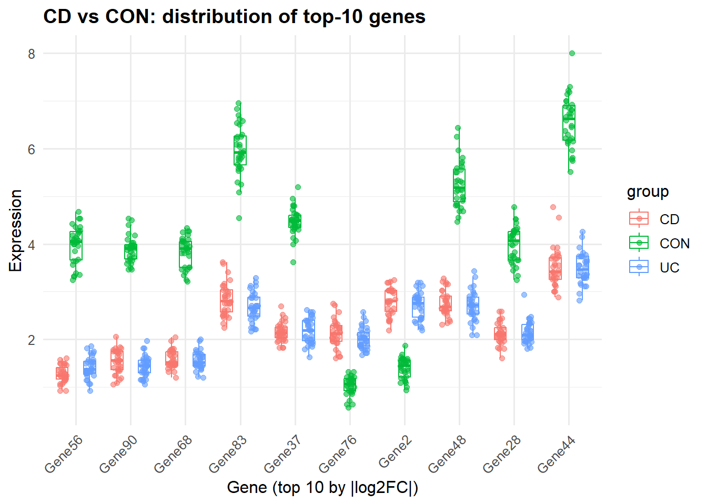
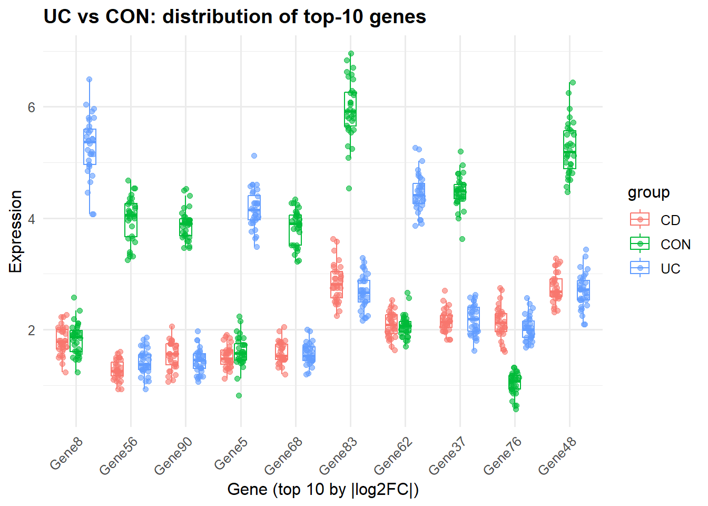

# Fluidigm 96-gene Expression Analysis 🧬

This repository contains an analysis of a **96 × 96 Fluidigm gene-expression plate**.

Each plate contains:

* **96 genes** (anonymised IDs: `Gene1`, `Gene2`, …)
* **96 biopsies**, from three disease groups:

  * **CD** – Crohn’s disease
  * **UC** – Ulcerative colitis
  * **CON** – Controls

The goals of this analysis are to:

* explore sample separation using **PCA**,
* compare **unsupervised clustering** (k-means) to known clinical groups,
* quantify similarity of **mean gene expression** between groups,
* identify **top differentially expressed genes** between each pair of groups,
* visualise expression distributions of these top genes.

---

## 📂 Project structure

```text
.
├─ src/
│  └─ fluidigm_q2_analysis.R     # main analysis script
├─ results/                      # generated figures
│  ├─ pca_pc1_pc2.png
│  ├─ pca_pc2_pc3.png
│  ├─ kmeans_pca.png
│  ├─ uc_vs_cd_corr.png
│  ├─ cd_vs_con_corr.png
│  ├─ uc_vs_con_corr.png
│  ├─ topgenes_cd_con.png
│  ├─ topgenes_cd_uc.png
│  └─ topgenes_uc_con.png
└─ README.md
```

---

## ⚙️ Requirements

You need an R installation with the following packages:

* `tidyverse`
* `ggrepel`

You can install them with:

```r
install.packages(c("tidyverse", "ggrepel"))
```

---

## 🔍 Analyses

### 1. PCA of 96-gene expression

We perform PCA on the 96-gene expression matrix and visualise:

* **PC1 vs PC2**
* **PC2 vs PC3**

```markdown


```

These plots show that the three clinical groups (**CD**, **UC**, **CON**) form well-separated clusters in principal component space.

---

### 2. K-means clusters overlaid on PCA

We run **k-means with k = 3** on the first three principal components and overlay the cluster labels on the PCA plot:

```markdown

```

The unsupervised clusters correspond closely to the true clinical groups, indicating that the 96-gene panel captures the major disease differences.

---

### 3. Mean expression per gene and group

For each gene, we compute **mean expression** separately in:

* CD
* UC
* CON

This gives one mean per `(gene, group)` pair, which is then used in the correlation analysis and fold-change calculations.

---

### 4. Correlation of gene-level means between groups

We compare mean expression across genes between all pairs of groups:

* **UC vs CD**
* **CD vs CON**
* **UC vs CON**

For each comparison we show a scatterplot with a linear fit and report the **Pearson correlation**:

```markdown



```

The correlations are very high, showing that overall gene expression profiles are broadly similar across conditions, although individual genes can still differ.

---

### 5. Top genes by |log2 fold change|

For each pair of groups we compute the **log2 fold change** of mean expression per gene and select the **top 10 genes** with the largest absolute |log2FC|:

* CD vs CON
* CD vs UC
* UC vs CON

These genes represent the strongest expression differences between the groups.

---

### 6. Expression distributions for top genes

For the top-10 genes in each comparison, we plot the full distribution of expression (boxplots + jitter) across all samples and groups:

```markdown



```

These plots highlight which genes are strongly **up- or down-regulated** between groups, and whether differences are consistent across individual patients.

---

## 🙏 Acknowledgements

This analysis is based on the **Fluidigm 96-gene panel** dataset.
All gene identifiers are anonymised and used only for educational purposes.

---
